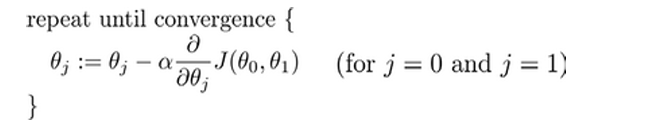
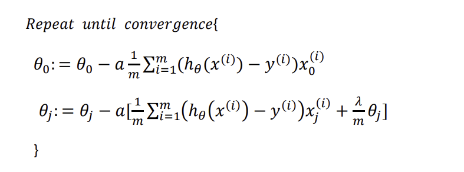
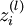
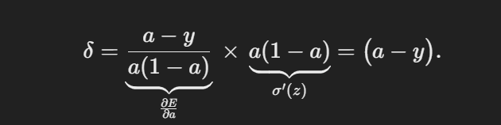

#  机器学习

# 代码注意事项

从n,m维的矩阵中取出的X[:,idx]或者X[idx,:]**默认是（n,）**

遍历（n,1）维的数组时，需要用**ravel**展开

注意pandas读取数据的类型，如果是uint8类型计算时会导致**溢出**，需要进行转换**X = X.astype(np.float32)**


# 常用库函数

## 优化函数

```python
from scipy.optimize import minimize
'''
fun 目标函数
x0 初始猜测值，也是fun的第一个参数
args 传递给fun的额外参数
jac fun是否会返回梯度，True表示会返回，且fun要返回(f, grad)形式，如果不返回则自行提供一个梯度函数
options 额外配置比如如最大迭代次数

'''
fmin=opt.minimize(fun=back_propagate,x0=params,args=(input_size,hidden_size,num_label,y_hot,learning_rate),
                  method='TNC',jac=True,options={'maxiter':250})
```


# 什么是机器学习

**一个程序被认为能从经验E中学习，解决任务T，达到性能度量值P，当且仅当有了经验E后，经过P的批判，程序能在处理T的时候性能有所提升。**其中E可以认为是成千上万次练习，而T可以认为是下棋，P则是赢得棋局的概率。


# 监督学习

监督学习是指**给算法一个数据集，并且给定正确的答案，算法的目标是给出更多的正确答案**。

监督学习有两类问题：其中一个是**回归问题**，**预测连续的输出值**；另一个是**分类问题**，**推测出离散的输出值**。


# 无监督学习

无监督学习就是给定一个无标签的数据集，从中找出某种数据结构。比如从音频中分离出人声和背景声。


# 模型表示


# 代价函数

拟合的目标是选择合适的参数使得代价平方误差函数最小。

对于回归问题，最基本的代价函数是均方误差损失函数


一阶拟合函数的代价函数变化如下


线性回归的代价函数是**convex function**


因此梯度下降一定可以得到**全局最优解**

# 梯度下降

梯度下降是一种用于求函数最小值的算法，其背后的思想是：**初始时选择一个任意的参数组合计算代价函数，然后寻找下一个能让代价函数下降最多的参数组合，一直重复操作直到到达一个局部最小值，初始时选择不同的参数可能会得到不同的全局最小值。**


批量梯度下降（batch gradient descent）算法的公式为：



展开有


注意要同时更新两个参数值，这里的a是**学习率**，代表每一次下降的大小。根据公式可以看出每一次更新参数值都会遍历一遍所有的数据，所以速度会很慢。


从一元函数来看，每次更新都会**减去斜率**，随着不断地更新，步幅也在不断的**减小**(代价函数趋向平稳)，当到达最小值时斜率为**0**则不会更新参数，此时收敛到局部最小值。


如果学习率太**小**会需要**很多步来逼近最小值**，如果学习率太**大**，可能会不**断越过最小点导致无法收敛**，经过证明的是，只要学习率足够小，代价会在每一轮迭代中下降，如果出现类似**弧形**的曲线，那么解决方案是**减小学习率**。

通常可以考虑尝试些学习率：  a =0.001，0.003，0.01，0.03，0.1，0.3，1，3，10


# 单变量线性回归


```python
path='ex1data1.txt'

# 读取数据
data=pd.read_csv(path,header=None,names=['Population','Profit'])

# 插入一行，作为偏移量
data.insert(0,'Ones',1)

cols=data.shape[1]

# 提取出输出和输出，转换为矩阵
X=np.matrix(data.iloc[:,:cols-1])
Y=np.matrix(data.iloc[:,-1:])

# 参数以一维形式初始化，计算时需要转置。第一个对应 偏移量的参数，第二个对于X的参数
theta=np.matrix(np.array([0,0]))

# 代价函数
def computCost(X,Y,theta):
    res=np.power((X*theta.T)-Y,2)
    return np.sum(res)/(2*len(X))


def batchGredientDescent(X,y,theta,iters,a):
    # 储存临时计算出的参乎上
    temp=np.matrix(np.zeros(theta.shape))
    # 储存每一轮迭代的代价
    cost=np.zeros(iters)
    # 参数个数
    parameter=int(theta.ravel().shape[1])
    
    # 迭代
    for i in range(iters):
        # 公式中的共有项
        error=(X*theta.T-y)
        
        # 同时更新
        for j in range(parameter):
            # 第一项是1不会有影响，因此正好更新了第二项
            term=np.multiply(error,X[:,j])
            # 公式求解
            temp[0,j]=theta[0,j]-(a/len(X))*np.sum(term)

        theta=temp
        cost[i]=computCost(X,Y,theta)
    return theta,cost


iters=1000
a=0.01

# 求解出最优参数
g,cost=batchGredientDescent(X,Y,theta,iters,a)

res=computCost(X,Y,g)

# 构图
fig,ax=plt.subplots(figsize=(12,8))
x=np.linspace(data['Population'].min(),data['Population'].max(),100)

ax.plot(x,g[0,0]+(g[0,1]*x),'r',label='Predit data')
ax.scatter(data['Population'],data['Profit'],label='Traning Data')
ax.set_xlabel('Population')
ax.set_ylabel('Profit')
ax.legend(loc=2)
ax.set_title('Predict data vs Population size')

plt.show()


fig,ax=plt.subplots(figsize=(12,8))
ax.plot(np.arange(iters),cost,'r')
ax.set_xlabel('Iteration')
ax.set_ylabel('Cost')
ax.set_title('Error vs traning Eproch')
plt.show()
```


通过观察代价函数在每一次迭代中的结果，可以检查算法是否正常工作


# 多变量线性回归

在单变量的基础上多了一些参数

```python
path='ex1data2.txt'
data=pd.read_csv(path,header=None,names=['area','cnt','price'])

data=(data-data.mean())/data.std()
data.insert(0,'Ones',1)

cols=data.shape[1]

x=data.iloc[:,0:-1]
y=data.iloc[:,-1:]

theta=np.matrix(np.array([0,0,0]))

X=np.matrix(x.values)
Y=np.matrix(y.values)

# 代价函数
def computCost(X,Y,theta):
    res=np.power((X*theta.T)-Y,2)
    return np.sum(res)/(2*len(X))
def batchGredientDescent(X,y,theta,iters,a):
    # 储存临时计算出的参乎上
    temp=np.matrix(np.zeros(theta.shape))
    # 储存每一轮迭代的代价
    cost=np.zeros(iters)
    # 参数个数
    parameter=int(theta.ravel().shape[1])
    
    # 迭代
    for i in range(iters):
        # 公式中的共有项
        error=(X*theta.T-y)
        
        # 同时更新
        for j in range(parameter):
            # 第一项是1不会有影响，因此正好更新了第二项
            term=np.multiply(error,X[:,j])
            # 公式求解
            temp[0,j]=theta[0,j]-(a/len(X))*np.sum(term)

        theta=temp
        cost[i]=computCost(X,Y,theta)
    return theta,cost

iters=1000
a=0.01

g,cost=batchGredientDescent(X,Y,theta,iters,a)

fig,ax=plt.subplots(figsize=(12,8))
ax.plot(np.arange(iters),cost,'r')
ax.set_xlabel('Iteration')
ax.set_ylabel('Cost')
plt.show()
```


# 库函数实现线性回归


```python
from sklearn import linear_model
from sklearn.datasets import fetch_california_housing
from sklearn.metrics import mean_squared_error, mean_absolute_error
# 导入数据集
hs_p= fetch_california_housing()

X=hs_p.data
y=hs_p.target

print(y)

# 转换为Dataframe类型方便插入
X=pd.DataFrame(X)

# 线性回归需要插入截距项
X.insert(0,-1,1)

# 导入模型
model=linear_model.LinearRegression()

# 训练数据，可以传入DataFrame和array类型，可以混搭
model.fit(X.iloc[:20000,:],y[:20000])

# 使用训练好的数据预测
res=model.predict(X.iloc[20000:,:])

# 比较误差，越小越好
print(mean_absolute_error(y[20000:],res))
print(mean_squared_error(y[20000:],res))
```


# 特征归一化

**归一化处理是将数据按比例缩放，使之落于一个较小的区间，在处理多个特征且量纲不同的数据时十分重要。**

**归一化可以提高模型收敛速度，提高模型精度，防止模型训练过程中发生数值计算错误，未经归一化处理的数据在搜索最优解的过程中可能会陷入缓慢前进或者模型震荡的状态，因为每个特征对模型的影响力不同，导致优化路径十分曲折。**


Z-score标准化，适用于有异常值的数据

```python
data=(data-data.mean())/data.std()
```


# 正规方程

在n较大的时候运行较慢(**1e3**的数量级，复杂度来自于矩阵的逆变换)，但是**不需要迭代**。

对于不可逆的矩阵，正规方程是不可用的


补充矩阵求导公式：


对于原公式


转换为矩阵形式有


展开求导，注意这里相乘的顺序不能颠倒


最后得到


直接套公式求解

```python
# 注意矩阵matrix已被弃用
X=np.array(x.values)
Y=np.array(y.values)

res=np.linalg.inv(X.T@X)@X.T@Y
```


# 逻辑回归

逻辑回归的假设模型是：**对于给定的输入变量，根据选择的参数计算输出变量等于1的可能**


其中g是sigmod函数，


当g(z)>=0.5时预测y=1，反之y=0，根据图像可知，z求出的结果>=0时y=1，反之y=0


因此当给定参数时，通过与0比较大小可以得到一条决策边界。


逻辑回归的代价函数定义为


从图像上理解：当目标值y是1，h(x)的结果表示输出量是1的可能，当可能越大代价函数就越小，当h(x)趋近于0时，代价函数也会越来越大(因为与正确结果相悖)


将式子合并有


使用梯度下降，代价函数有


最后有


注意下述的是实现中使用Truncated Newton Conjugate-Gradient（TNC）算法——截断牛顿共轭梯度(原理较为复杂)来寻找最优参数

fmin_tnc(func=cost,x0=theta,fprime=gradient,args=(x,y))，其中theta必须是行向量形式，且cost和fprime的第一个参数必须是theta

```python
filename='ex2data1.txt'
data=pd.read_csv(filename,header=None,names=['Exam1','Exam2','Admitted'])

# 按照类别划分数据
pos=data[data['Admitted']==1]
neg=data[data['Admitted']==0]

# 绘图
fig,ax=plt.subplots(figsize=(12,8))
ax.scatter(pos['Exam1'],pos['Exam2'],color='blue',label='AC')
ax.scatter(neg['Exam1'],neg['Exam2'],color='r',marker='x',label='WA')
ax.legend()

# plt.show()

# sigmod函数
def sigmod(x):
    return 1/(1+np.exp(-x))

# 常数项
data.insert(0,'Ones',1)
cols=data.shape[1]

# 正则化
data.iloc[:,1:-1]=(data.iloc[:,1:-1]-data.iloc[:,1:-1].mean())/data.iloc[:,1:-1].std()

# 输出和输出 X.shape, y.shape分别是((100, 3), (100, 1))
x=np.array(data.iloc[:,:cols-1].values)
y=np.array(data.iloc[:,cols-1:].values)

# 注意参数初始化为行向量，在计算时可以通过reshape(-1,1)变为列向量
theta=np.zeros(cols-1)

# 代价函数
def cost(theta,X,y):
    # 注意维度
    return -np.sum(y*np.log(sigmod(X@theta.reshape(-1,1)))+(1-y)*np.log(1-sigmod(X@theta.reshape(-1,1))))/len(X)

# 计算步长，没有执行梯度下降
def gradient(theta,X,y):
    paramater=theta.shape[0]
    term=np.zeros(paramater)
    error=(sigmod(X@theta.reshape(-1,1))-y)

    for j in range(paramater):
        # 下面是向量乘法
        term[j]=np.sum(error*X[:,j].reshape(-1,1))/len(X)
    return term

# fmin_tnc是一种常用的寻找最优参数的算法
# 按照参数的要求待机函数和梯度函数中第一个参数必须要(n,)的参数向量，其他的参数通过args用元组的形式传入
best_theta,_,_=opt.fmin_tnc(func=cost,x0=theta,fprime=gradient,args=(x,y))

# 给定参数和输入预测结果
def predict(X,theta):
    possible=sigmod(X@theta.reshape(-1,1))
    return [1 if x>=0.5 else 0 for x in possible]

# 比较预测值和真实值
res=predict(x,best_theta)
compare=[ 1 if i==j  else 0 for i,j in zip(res,y)]
accury=sum(compare)/len(compare)
print(accury)
```


注意逻辑回归一次只能处理二分类问题，因为我们根据h(x)的输出，来划分1和0，因此对于多个类别，需要为**每个类别训练一个模型**，求解某个类别时使用对应的模型来处理数据。


[多分类的逻辑回归](./个人代码实现/ex3.html)


# 过拟合问题

通过引入**高阶项以及其他许多的特征**可以很好的拟合训练数据，但是训练出的模型**推广**到新的数据的效果并不好。


当出现了过拟合问题时，可以通过以下两种方法解决

+ 丢弃一些不必要的特征，或者使用模型来帮助选择特征
+ 正则化——保留所有的特征，但是减小参数的大小


# 正则化

正则化的基本思想是：在一定程度上**减小高次项参数的值**，所要做的是修改**代价函数**为其中的高次项参数引入**惩罚**，因此在尝试最小化代价函数的过程中也会将惩罚纳入考虑，最终选择较小的参数项。

如果有许多特征不知道要选取那些作为惩罚项时，将对**除了$\theta_0$的参数**引入惩罚


其中$\lambda$是正则化参数，如果过大会导致所有的参数都被最小化(为0)，图像变为一条直线。


对于线性回归的梯度下降有，对于参数$theta_0$特判



而对于正规方程需要额外添加一个**矩阵项**，经过证明的是$$X^TX+\theta[矩阵]$$一定是**可逆的**。


逻辑回归的式子与线性回归相同


代码实现见下

[regression_regularization](./个人代码实现/line_regression_regularization.html)


# 非线性假设

逻辑回归和线性回归在**特征太多**时，计算的负荷会非常大——当有100个特征时，如果仅仅使用两两组合也会有接近5000多个组合而成的特征。


# 神经网路

神经网络模型大致如下，每一层都会包含一个偏置项，但是偏置项是没有输出连接的。


第一层称为**输入层**，最后一层是**输出层**，中间的称为**隐藏层**，隐藏层中的每个单元称为**激活单元**，其采纳一些特征作为输入，并根据**自身模型**提供一个输出。


其中  是第  层第  单元与第  层第  单元之间的联接参数（其实就是连接线上的权重，注意标号顺序），  是第  层第  单元的偏置项。


计算过程如下：


一般用用  表示第  层第  单元输入加权和（包括偏置单元），比如，  ，则  。

这样就有更简洁的表示方法了


上述的计算步骤就是前向传播，只要给定前一层的激活值，那么后一层就可以递推出来


每一层求解出的特征是**神经网络通过学习**得到的一系列用于预测变量的**新特征**，这些特征值比将输入组合为高次项更为**有效**。

假设X有(5000,400)，这里的$$a_1^{(1)}$$是(1,400)的**行向量**也就是训练并不会修改**输入的个数**，**而是在输入的特征个数上拟合训练**


假设神经网络的训练样本有$m$个，每个包含一组输入$x$和一组输出信号$y$，$L$表示神经网络层数，$S_I$表示每层的**neuron**个数($S_l$表示输出层神经元个数)，$S_L$代表最后一层中处理单元的个数。

将神经网络的分类定义为两种情况：**二类分类和多类分类**，

二类分类：$S_L=0, y=0\, or\, 1$表示哪一类；

$K$类分类：$S_L=k, y_i = 1$表示分到第$i$类；$(k>2)$，最后的输出层有**k个节点**，经过sigmoid的激活函数得到一个向量，表示当前输入对应的每个分类的可能。


$J(\Theta) = -\frac{1}{m} \left[ \sum\limits_{i=1}^{m} \sum\limits_{k=1}^{k} {y_k}^{(i)} \log {(h_\Theta(x^{(i)}))}{_k} + \left( 1 - y_k^{(i)} \right) \log \left( 1- {\left( h_\Theta \left( x^{(i)} \right) \right)}{_k} \right) \right] + \frac{\lambda}{2m} \sum\limits_{l=1}^{L-1} \sum\limits_{i=1}^{s_l} \sum\limits_{j=1}^{s_{l+1}} \left( \Theta_{ji}^{(l)} \right)^2$。

正则项实际就是**所有的参数除了每一层的偏置参数的平方和**


## 反向传播算法

在预测神经网络的果是使用了一种**正向传播方法**，即从第一层开始正向一层一层计算，直到最后一层h(x)

而为了计算代价函数的偏导$\frac{\partial}{\partial\Theta^{(l)}_{ij}}J\left(\Theta\right)$，需要采用一种**反向传**播的方法，首先计算出**最后一层误差**，然后一层一层反向求出误差，直到**倒数第二层**(第一层是输入没有误差)。


假设我们的训练集只有一个样本$\left({x}^{(1)},{y}^{(1)}\right)$，我们的神经网络是一个四层的神经网络，其中$K=4，S_{L}=4，L=4$：

前向传播算法：


令总体代价为


目标是调整权重使得代价最小，通过求偏导来使用梯度下降‘


用链式法则求解输出层的误差，有


因此输出层的误差有


输出层误差求导后有


最后有输出层的误差


对于隐藏层有


因此隐藏层的误差为


更新权重


可得参数更新公式为


当代价函数为交叉熵，即$$J\left(\theta\right)=\frac{1}{m}\sum\limits_{i=1}^{m}{[-{{y}^{(i)}}\log \left( {{h}_{\theta }}\left( {{x}^{(i)}} \right) \right)-\left( 1-{{y}^{(i)}} \right)\log\left( 1-{{h}_{\theta }}\left( {{x}^{(i)}} \right) \right)]}$$，且激活函数为sigmoid时




输出层的损失函数化简为简洁的形式


在实际实现中会有很多个输入变量，会将所有输入变量计算出的梯度**累加取平均**

公式推导见[解读反向传播算法（图与公式结合） - 知乎](https://zhuanlan.zhihu.com/p/96046514)

代码实现见[ex4](./个人代码实现/ex4.html)


# 偏差和方差

当训练好的模型对于未知数据有较大误差时，通常有以下几种解决方案

1. 尝试减少特征的数量 
2. 尝试获得更多的特征 
3. 尝试增加多项式特征 
4. 尝试减少正则化程度𝜆 
5. 尝试增加正则化程度𝜆


当判断一个模型是否是**过拟合**时，一种方式是将数据分为**训练集和测试集**(7:3)，注意需要保证数据不存在**趋势**(如果存在需要预先打乱)，在测试集上使用训练集得出的**模型**计算误差。

对于线性回归代价函数不变，对于逻辑回归可以额外使用**误分类的比率**


假设要在10个不同最高次的模型中选择


将数据分为**训练集，交叉验证集，测试集** 6:2:2

模型选择的方法为： 

1. 使用训练集训练出 10 个模型 
2. 用 10 个模型分别对交叉验证集计算得出**交叉验证误差**（代价函数的值） 
3. 选取代价函数值**最小**的模型  
4. 用步骤 3 中选出的模型对测试集计算得出**推广误差**（代价函数的值）


当运行学习算法时如果结果不理想，多半是出现了**高偏差(bias)或者是高方差(Variance)**，也就说欠拟合和过拟合。


在d较小时，**训练集的误差较大**，随着d增大，**误差逐渐减小**(对已有的数据拟合的更好)

在d较小时，**验证集误差较大**，随着d增大，**误差先减小后增大(过拟合)**


**当验证集误差接近训练集误差时——偏差/欠拟合**

**当验证集误差远远大于训练集误差时——方差/过拟合**


**正则化参数**同样会对拟合产生影响

正则化参数的选择方式同高次项的选择，一般从1-10之间按照两倍的关系(0,0.01,0.02,0.04,0.08,0.15,0.32,0.64,1.28,2.56,5.12,10共 12 个)来选，将数据分为三个部分

1.使用训练集训练出 **12 个不同程度正则化的模型** 

2.用 12 个模型分别对**交叉验证集计算的出交叉验证误差** 

3.选择得出**交叉验证误差最小的模型** 

4.运用步骤 3 中选出模型对测试集计算得出**推广误差**


当 𝜆 较小时，**训练集误差较小（过拟合）而交叉验证集误差较大**

随着 𝜆 的增加，**训练集误差不断增加（欠拟合），而交叉验证集误差则是先减小后增加**


学习曲线可以判断学习算法是否处于偏差/方差的问题，**其将训练集误差和验证集误差作为训练集大小的函数**，当训练集较小时，训练集误差会很小，但是验证集误差会很大。

随着训练集的增大

欠拟合情况下，**增大样本数据**误差不会有太大改观，**两个误差接近且很高**


过拟合情况下，**增大样本个数可以提高算法的效果**


因此对于解决方案

1. **获得更多的训练实例——解决高方差** 
2.  **尝试减少特征的数量——解决高方差** 
3.  **尝试获得更多的特征——解决高偏差** 
4. **尝试增加多项式特征——解决高偏差** 
5. **尝试减少正则化程度 λ——解决高偏差** 
6. **尝试增加正则化程度 λ——解决高方差**


代码见[ex5](./个人代码实现/ex5.html)


# 误差分析

**有时准确率不能作为评判性能的标准**——比如对于一个只有**5%的数据为false**的数据集，一个只会输出1的函数的准确率可以达到95%，比学习算法得到结果更好，这类数据集称为**偏斜类**（skewed classes），准确率是不能用于评价模型好坏的。

定义**查准率(precision)**和**查全率(recall)**，以及四种预测结果

1. **正确肯定（True Positive,TP）：预测为真，实际为真** 
2. **正确否定（True Negative,TN）：预测为假，实际为假** 
3. **错误肯定（False Positive,FP）：预测为真，实际为假** 
4. **错误否定（False Negative,FN）：预测为假，实际为真**


查准率=**TP/(TP+TN)**例，在所有我们预测有恶性肿瘤的病人中，实际上有恶性肿瘤的病人的百分比，**越高越好**

查全率=**TP/(TP+FN)**例，在所有实际上有恶性肿瘤的病人中，成功预测有恶性肿瘤的 病人的百分比，**越高越好**


如果更在意**查准率**，那么就**提高阈值**，反之**降低阈值**

对于想要**平衡**二者的分类模型，选择能得到**最高F1 Score**的阈值


