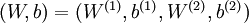

#  机器学习

机器学习指**利用算法识别一组数据中的模式并做出预测**


机器学习的主要挑战是：

- 缺乏数据
- 数据质量不佳
- 简单的模型欠拟合，复杂的模型过拟合


# 机器学习过程

首先进行**EDA探索性数据分析**，即绘图分析自变量对因变量的影响，了解数据的基本情况(大小，类型，缺失值比例——判断是否要丢弃，特征数量)，找出变量之间的关系(将差不多的特征归为一类)，通过可视化判断数据是否偏态，是否存在长尾。

随后进行特征工程，填补缺失值和修正异常值，特征选择，特征转换(one hot编码)，特征构造，归一化。

模型选择，建立多个模型，搜索超参数选择最好的

预测结果

# 代码注意事项

从n,m维的矩阵中取出的X[:,idx]或者X[idx,:]**默认是（n,）**

遍历（n,1）维的数组时，需要用**ravel**展开

注意pandas读取数据的类型，如果是uint8类型计算时会导致**溢出**，需要进行转换**X = X.astype(np.float32)**


# 常用库函数

## 优化函数

```python
from scipy.optimize import minimize
'''
fun 目标函数
x0 初始猜测值，也是fun的第一个参数
args 传递给fun的额外参数
jac fun是否会返回梯度，True表示会返回，且fun要返回(f, grad)形式，如果不返回则自行提供一个梯度函数
options 额外配置比如如最大迭代次数

'''
fmin=opt.minimize(fun=back_propagate,x0=params,args=(input_size,hidden_size,num_label,y_hot,learning_rate),
                  method='TNC',jac=True,options={'maxiter':250})
```

# 数据可视化

除了基本的pd.info() pd.describe()之类的，可以通过ProfileReport更快的展示数据

```python
from ydata_profiling import ProfileReport
profile = ProfileReport(train, title="Train Data Profiling Report", explorative=True)

# 在Notebook中展示报告
profile.to_notebook_iframe()
```


# 特征工程

## 数据预处理

### 缺失值

对于缺失值：

+ 删除缺失值
  + 删除**实例**
  + 删除**特征**
+ 填充缺失值
  + **固定值，均值，中位数，众数**
  + 作为**None**，代表不存在
  + **Random Forest**填充
  + **KNN** 填充

### 异常值


对于异常值：

+ 删除异常值
  + **绘图**，找出异常值的条件删除


### 归一化

归一化可以提高模型收敛速度，提高模型精度，防止模型训练过程中发生数值计算错误，未经归一化处理的数据在搜索最优解的过程中可能会陷入缓慢前进或者模型震荡的状态，因为每个特征对模型的影响力不同，导致优化路径十分曲折。


对于依赖距离内积，梯度的模型，需要标准化

| 模型类别 | 代表模型                                   | 是否需要标准化 |
| -------- | ------------------------------------------ | -------------- |
| 线性模型 | LinearRegression、Ridge、Lasso、ElasticNet | ✅ 需要         |
| SVM      | SVC, SVR                                   | ✅ 需要         |
| KNN      | KNeighborsClassifier, KNeighborsRegressor  | ✅ 需要         |
| PCA/降维 | PCA, LDA                                   | ✅ 需要         |
| 神经网络 | MLPRegressor, MLPClassifier                | ✅ 需要         |
| 聚类     | KMeans                                     | ✅ 需要         |


模型内部有排序分裂等机制，对数值大小不敏感

| 模型类别 | 代表模型                    | 是否需要标准化                   |
| -------- | --------------------------- | -------------------------------- |
| 树模型   | DecisionTree, RandomForest  | ❌ 不需要                         |
| 提升模型 | XGBoost, LightGBM, CatBoost | ❌ 通常不需要（但有时仍建议试试） |


此外ElasticNet和Lasso对**异常值**敏感，需要RobustScaler处理


Min-Max 归一化	，将数据压缩到[0,1]之间，适用于需要保持原始比例的情况 


Z-score标准化，将数据调整为正态分布，适用于数据分布接近**正态分布**的情况


```python
from sklearn.preprocessing import StandardScaler
scaler = StandardScaler()
X_scaled = scaler.fit_transform(X)
```


Robust归一化使用**中位数**和**四分位间距**，适合数据中有异常值和离群点


```python
from sklearn.preprocessing import RobustScaler
scaler = RobustScaler()
X_scaled = scaler.fit_transform(X)
```


可以借助pipeline流程化需要预处理的模型

```python
from sklearn.pipeline import make_pipeline
from sklearn.preprocessing import RobustScaler
from sklearn.linear_model import Lasso

model = make_pipeline(RobustScaler(), Lasso(alpha=0.001))
```


### 独热编码

在分类，回归，聚类等学习算法中，特征之间**距离**的计算或者**相似度**的计算是十分重要的，独热编码将离散特征的取值扩展到了**欧式空间**，可以让特征之间的计算更加合理，注意要求特征不属于**有序变量**，如：`教育程度`（小学 < 初中 < 高中 < 大学）、`质量等级`（差、中、好）

比如有一个离散型特征表示工作类型 $$x_1=1,x_2=2,x_3=3$$，这些信息之间不存在**顺序**

在计算两个工作之间的距离时$$(x_1, x_2) = 1, d(x_2, x_3) = 1, d(x_1, x_3) = 2$$，这样计算出的特征是不合理的，转换为**独热编码**后求解出的两个工作之间的距离是一样的

 

独热编码将分类变量转换为二进制向量，每个类别都对应二进制中唯一的有效位，避免了类别之间出现大小关系。


****


pd.get_dummies()用独热编码代替**object** 或 **category** 类型，并**删除**原来的列，对于**int类型**的离散型数据可以先**手动**转换为string类型

```python
import pandas as pd

df = pd.DataFrame({'Color': ['Red', 'Green', 'Blue']})
pd.get_dummies(df)

   Color_Blue  Color_Green  Color_Red
0           0            0          1
1           0            1          0
2           1            0          0
```


### 偏态数据

首先绘制图像判断是否偏态(skewness)

```python
sns.histplot(train['SalePrice'],kde=True)
```


该图出现的情况是右偏(正偏）均值>中位数，房价，收入等，大部分数据集中在左侧，右部尾巴长


绘制Q-Q图(分位数对分位数，横轴是标准正态分布分位数，纵轴是样本数据的分位数)，比较两个分布的分位数来判断是否相似。

```python
from scipy.stats import norm,skew
stats.probplot(train['SalePrice'],plot=ax[1])
```


排列接近直线——正态分布，尾部上扬——数据右偏，尾部下垂——数据左偏 


许多模型（如线性回归、逻辑回归、PCA）默认数据近似正态分布，并且极端值容易影响统计结果。


对于右偏数据一般进行对数处理(非负数)

或者**boxcox**转换


```python
train['SalePrice']=np.log1p(train['SalePrice']) # log(1+x)

from scipy.special import boxcox1p
boxcox1p(x, λ)
```


处理偏态数据

```python
skewness=skewness[abs(skewness)>0.75]
skewed_features=skewness.index
lam=0.15
for feat in skewed_features:
    full[feat]=boxcox1p(full[feat],lam)
```

# 基础概念

## 超参数

超参数是在**训练机器学习模型之前**手动设置的参数，它们**不会在训练中自动更新**，而是由人工或自动优化方法得到的

比如学习率，正则化参数，神经元个数

## 有监督学习和无监督学习

有监督(Supervised)学习给定的训练数据中包含有标签(label)，模型的目标是学会输入-输出的映射

无监督学习给定的训练数据中不包含标签，目标是发现数据中的模式


## 代价函数

拟合的目标是选择合适的参数使得代价平方误差函数最小。

对于回归问题，最基本的代价函数是**均方误差损失函数**


一阶拟合函数的代价函数变化如下


线性回归的代价函数是**convex function**


因此梯度下降一定可以得到**全局最优解**


## 交叉验证

交叉验证是一种评估机器学习模型泛化能力的方法，将数据集划分为多个子集，多次训练和测试模型


最常见的是**K折交叉验证（K-Fold Cross-Validation）**

1. 将原始数据集划分为$k$个大小相近的子集（folds）；
2. 每次从$k$个子集中选一个作为**验证集**，其余$k-1$个作为**训练集**；
3. 训练并评估模型，共进行$k$次；
4. 将$k$次的验证结果（如准确率、MSE）**取平均**，作为模型的性能指标。

充分利用数据集，结果更稳定可靠


## 偏差和方差

当运行学习算法时如果结果不理想，多半是出现了**高偏差(bias)或者是高方差(Variance)**，也就说欠拟合和过拟合。

偏差：**模型预测的期望值与真实值的差距**，方差：**不同样本下模型预测结果的波动程度**。注意数学上方差的计算公式是


当验证集误差接近训练集误差时——偏差/欠拟合

当验证集误差远远大于训练集误差时——方差/过拟合


1. **获得更多的训练实例——解决高方差** 
2. **尝试减少特征的数量——解决高方差** 
3. **尝试获得更多的特征——解决高偏差** 
4. **尝试增加多项式特征——解决高偏差** 
5. **尝试减少正则化程度 λ——解决高偏差** 
6. **尝试增加正则化程度 λ——解决高方差**


代码见[ex5](./个人代码实现/ex5.html)

## 过拟合问题

通过引入**高阶项以及其他许多的特征**可以很好的拟合训练数据，但是训练出的模型**推广**到新的数据的效果并不好。


当出现了过拟合问题时，可以通过以下方法解决

+ 获取更多的数据
+ 简化模型：减少模型的参数，比如说神经网络中每层的节点数以及层数
+ 降维
+ 正则化


# 梯度下降

梯度下降是一种用于求函数最小值的算法，其背后的思想是：初始时选择一个任意的参数组合计算代价函数，然后寻找下一个能让代价函数下降最多的参数组合，一直重复操作直到到达一个局部最小值，初始时选择不同的参数可能会得到不同的全局最小值。


## 批量梯度下降(BGD)

更新参数时使用全部的数据集，开销较大，但是对于凸函数，一定可以收敛到**全局最优**。


批量梯度下降（batch gradient descent）算法的公式为：

$$
\theta := \theta - \eta \cdot \frac{1}{m}\sum_{i=1}^{m}\nabla J_i(\theta)
$$
其中$m$是训练样本数，∇J(θ)是损失函数的梯度


展开有


注意要同时更新两个参数值，这里的a是**学习率**，代表每一次下降的大小。根据公式可以看出每一次更新参数值都会遍历一遍所有的数据，所以速度会很慢。


如果学习率太**小**会需要**很多步来逼近最小值**，如果学习率太**大**，可能会不**断越过最小点导致无法收敛**，经过证明的是，只要学习率足够小，代价会在每一轮迭代中下降，如果出现类似**弧形**的曲线，那么解决方案是**减小学习率**。

通常可以考虑尝试些学习率：a=0.001，0.003，0.01，0.03，0.1，0.3，1，3，10

## 随机梯度下降(SGD)

观察BGD的公式，需要使用所有样本来更新参数，不适用于数据规模较大的时候

随机抽取一个样本来计算梯度，速度更快，能够跳出局部最优，但是不容易收敛。


## 小批量梯度下降(mini-batch)

每次使用**一部分样本**来计算梯度，结合了批量梯度下降的稳定性和随机梯度下降的高效性，但是batch_size不好调节。


# 正则化

正则化通过**限制模型的复杂度**，防止模型对训练数据拟合的**过于精细**，而无法泛化得到新数据，当模型过于复杂时，它不仅学到了数据的**真实模式（patterns）**，还学到了**噪声（noise）和细节**。

正则化的基本思想：在损失函数中加入**额外的惩罚项**，限制模型的参数规模，使其学习**更加平滑和简单**


噪声指学习中**随机的无意义的**变化，复杂的模型可能会记住噪声，可以通过降维或者正则化排除噪声的影响。

## L2正则化

L2正则化，在损失函数中添加了模型参数的平方和惩罚项：$J(\theta) = \text{Loss} + \lambda \sum_{i=1}^{n} \theta_i^2$

其中：

- **$\lambda$** 是正则化强度的超参数，控制惩罚项的大小。
- **$\sum_{i=1}^{n} \theta_i^2$** 约束权重，使它们尽可能小。

作用：

- 特征少，但所有特征都很重要


## L1正则化

 L1正则化（Lasso Regression），L1正则化在损失函数中添加了**模型参数的绝对值和惩罚项**：$J(\theta) = \text{Loss} + \lambda \sum_{i=1}^{n} |\theta_i|$


作用：

- 可以将一些权重$\theta_i$直接收缩到0，实现特征选择（**即让不重要的特征系数变为 0**）。
- 适用于特征较多，希望选择重要特征


# 模型


## 线性回归

### 单变量线性回归


```python
path='ex1data1.txt'

# 读取数据
data=pd.read_csv(path,header=None,names=['Population','Profit'])

# 插入一行，作为偏移量
data.insert(0,'Ones',1)

cols=data.shape[1]

# 提取出输出和输出，转换为矩阵
X=np.matrix(data.iloc[:,:cols-1])
Y=np.matrix(data.iloc[:,-1:])

# 参数以一维形式初始化，计算时需要转置。第一个对应 偏移量的参数，第二个对于X的参数
theta=np.matrix(np.array([0,0]))

# 代价函数
def computCost(X,Y,theta):
    res=np.power((X*theta.T)-Y,2)
    return np.sum(res)/(2*len(X))


def batchGredientDescent(X,y,theta,iters,a):
    # 储存临时计算出的参乎上
    temp=np.matrix(np.zeros(theta.shape))
    # 储存每一轮迭代的代价
    cost=np.zeros(iters)
    # 参数个数
    parameter=int(theta.ravel().shape[1])
    
    # 迭代
    for i in range(iters):
        # 公式中的共有项
        error=(X*theta.T-y)
        
        # 同时更新
        for j in range(parameter):
            # 第一项是1不会有影响，因此正好更新了第二项
            term=np.multiply(error,X[:,j])
            # 公式求解
            temp[0,j]=theta[0,j]-(a/len(X))*np.sum(term)

        theta=temp
        cost[i]=computCost(X,Y,theta)
    return theta,cost


iters=1000
a=0.01

# 求解出最优参数
g,cost=batchGredientDescent(X,Y,theta,iters,a)

res=computCost(X,Y,g)

# 构图
fig,ax=plt.subplots(figsize=(12,8))
x=np.linspace(data['Population'].min(),data['Population'].max(),100)

ax.plot(x,g[0,0]+(g[0,1]*x),'r',label='Predit data')
ax.scatter(data['Population'],data['Profit'],label='Traning Data')
ax.set_xlabel('Population')
ax.set_ylabel('Profit')
ax.legend(loc=2)
ax.set_title('Predict data vs Population size')

plt.show()


fig,ax=plt.subplots(figsize=(12,8))
ax.plot(np.arange(iters),cost,'r')
ax.set_xlabel('Iteration')
ax.set_ylabel('Cost')
ax.set_title('Error vs traning Eproch')
plt.show()
```


通过观察代价函数在每一次迭代中的结果，可以检查算法是否正常工作


### 多变量线性回归

在单变量的基础上多了一些参数

```python
path='ex1data2.txt'
data=pd.read_csv(path,header=None,names=['area','cnt','price'])

data=(data-data.mean())/data.std()
data.insert(0,'Ones',1)

cols=data.shape[1]

x=data.iloc[:,0:-1]
y=data.iloc[:,-1:]

theta=np.matrix(np.array([0,0,0]))

X=np.matrix(x.values)
Y=np.matrix(y.values)

# 代价函数
def computCost(X,Y,theta):
    res=np.power((X*theta.T)-Y,2)
    return np.sum(res)/(2*len(X))
def batchGredientDescent(X,y,theta,iters,a):
    # 储存临时计算出的参乎上
    temp=np.matrix(np.zeros(theta.shape))
    # 储存每一轮迭代的代价
    cost=np.zeros(iters)
    # 参数个数
    parameter=int(theta.ravel().shape[1])
    
    # 迭代
    for i in range(iters):
        # 公式中的共有项
        error=(X*theta.T-y)
        
        # 同时更新
        for j in range(parameter):
            # 第一项是1不会有影响，因此正好更新了第二项
            term=np.multiply(error,X[:,j])
            # 公式求解
            temp[0,j]=theta[0,j]-(a/len(X))*np.sum(term)

        theta=temp
        cost[i]=computCost(X,Y,theta)
    return theta,cost

iters=1000
a=0.01

g,cost=batchGredientDescent(X,Y,theta,iters,a)

fig,ax=plt.subplots(figsize=(12,8))
ax.plot(np.arange(iters),cost,'r')
ax.set_xlabel('Iteration')
ax.set_ylabel('Cost')
plt.show()
```


### 库函数实现线性回归

```python
from sklearn import linear_model
from sklearn.datasets import fetch_california_housing
from sklearn.metrics import mean_squared_error, mean_absolute_error
# 导入数据集
hs_p= fetch_california_housing()

X=hs_p.data
y=hs_p.target

print(y)

# 转换为Dataframe类型方便插入
X=pd.DataFrame(X)

# 线性回归需要插入截距项
X.insert(0,-1,1)

# 导入模型
model=linear_model.LinearRegression()

# 训练数据，可以传入DataFrame和array类型，可以混搭
model.fit(X.iloc[:20000,:],y[:20000])

# 使用训练好的数据预测
res=model.predict(X.iloc[20000:,:])

# 比较误差，越小越好
print(mean_absolute_error(y[20000:],res))
print(mean_squared_error(y[20000:],res))
```


### 正规方程

在n较大的时候运行较慢(**1e3**的数量级，复杂度来自于矩阵的逆变换)，但是**不需要迭代**。

对于不可逆的矩阵，正规方程是不可用的


补充矩阵求导公式：


​								  


​						


对于原公式


转换为矩阵形式有


展开求导，注意这里相乘的顺序不能颠倒


最后得到


直接套公式求解

```python
# 注意矩阵matrix已被弃用
X=np.array(x.values)
Y=np.array(y.values)

res=np.linalg.inv(X.T@X)@X.T@Y
```


## 逻辑回归

逻辑回归的假设模型是：，其中g是sigmod函数，


当g(z)>=0.5时预测y=1，反之y=0，根据图像可知，z求出的结果>=0时y=1，反之y=0


通过sigmod函数将线性结果映射到[0,1]之间


因此当给定参数时，通过与0比较大小可以得到一条决策边界。


逻辑回归的代价函数为交叉熵损失


从图像上理解：当目标值y是1，h(x)的结果表示输出量是1的可能，当可能越大代价函数就越小，当h(x)趋近于0时，代价函数会越来越大(因为与正确结果相悖)


将式子合并有


使用梯度下降，代价函数有


最后有


注意下述的是实现中使用Truncated Newton Conjugate-Gradient（TNC）算法——截断牛顿共轭梯度(原理较为复杂)来寻找最优参数

fmin_tnc(func=cost,x0=theta,fprime=gradient,args=(x,y))，其中theta必须是行向量形式，且cost和fprime的第一个参数必须是theta

```python
filename='ex2data1.txt'
data=pd.read_csv(filename,header=None,names=['Exam1','Exam2','Admitted'])

# 按照类别划分数据
pos=data[data['Admitted']==1]
neg=data[data['Admitted']==0]

# 绘图
fig,ax=plt.subplots(figsize=(12,8))
ax.scatter(pos['Exam1'],pos['Exam2'],color='blue',label='AC')
ax.scatter(neg['Exam1'],neg['Exam2'],color='r',marker='x',label='WA')
ax.legend()

# plt.show()

# sigmod函数
def sigmod(x):
    return 1/(1+np.exp(-x))

# 常数项
data.insert(0,'Ones',1)
cols=data.shape[1]

# 正则化
data.iloc[:,1:-1]=(data.iloc[:,1:-1]-data.iloc[:,1:-1].mean())/data.iloc[:,1:-1].std()

# 输出和输出 X.shape, y.shape分别是((100, 3), (100, 1))
x=np.array(data.iloc[:,:cols-1].values)
y=np.array(data.iloc[:,cols-1:].values)

# 注意参数初始化为行向量，在计算时可以通过reshape(-1,1)变为列向量
theta=np.zeros(cols-1)

# 代价函数
def cost(theta,X,y):
    # 注意维度
    return -np.sum(y*np.log(sigmod(X@theta.reshape(-1,1)))+(1-y)*np.log(1-sigmod(X@theta.reshape(-1,1))))/len(X)

# 计算步长，没有执行梯度下降
def gradient(theta,X,y):
    paramater=theta.shape[0]
    term=np.zeros(paramater)
    error=(sigmod(X@theta.reshape(-1,1))-y)

    for j in range(paramater):
        # 下面是向量乘法
        term[j]=np.sum(error*X[:,j].reshape(-1,1))/len(X)
    return term

# fmin_tnc是一种常用的寻找最优参数的算法
# 按照参数的要求待机函数和梯度函数中第一个参数必须要(n,)的参数向量，其他的参数通过args用元组的形式传入
best_theta,_,_=opt.fmin_tnc(func=cost,x0=theta,fprime=gradient,args=(x,y))

# 给定参数和输入预测结果
def predict(X,theta):
    possible=sigmod(X@theta.reshape(-1,1))
    return [1 if x>=0.5 else 0 for x in possible]

# 比较预测值和真实值
res=predict(x,best_theta)
compare=[ 1 if i==j  else 0 for i,j in zip(res,y)]
accury=sum(compare)/len(compare)
print(accury)
```


注意逻辑回归一次只能处理二分类问题，因为我们根据h(x)的输出，来划分1和0，因此对于多个类别，需要为**每个类别训练一个模型**，求解某个类别时使用对应的模型来处理数据。


[多分类的逻辑回归](./个人代码实现/ex3.html)


## 支持向量机(SVM)

基本思想：在二分类问题上，找到一个超平面，使得使两类数据离这个超平面越远越好，对于线性可分的数据来说，超平面有无数多个，但是**几何间隔最大的只有一个**。


当数据无法在**原始特征空间**中用一条直线(二维)，或一个平面(三维)分开时，就需要用**核函数**把数据**映射到更高维的空间**。


只适合于**小样本**


代码如下[ex6](./个人代码实现/ex6.html)

## 岭回归Ridge和Lasso回归

岭回归是在线性回归的基础上加上L2正则化，Lasso则是加上L1正则化。


## K-means

K-means是一个**迭代式**算法

1. 首先**随机选择K个点**，对于数据集中的每一个数据，按照**距离K个中心点的距离**，将其与**最近的中心点**关联起来，与**同一个中心点关联起来的点聚为一类**。
2. 计算每一类的**平均值**，然后**移动该类中心点到均值处**
3. 不断重复上述步骤


K-means的代价函数是**最小化所有数据点与其中心点的距离之和**


K-means还可以用于图片压缩，**通过将同一类的像素点转换为相同颜色，减小颜色的种类**


缺点是**收敛速度慢，对异常值敏感**，可能会停留到局部最小值**(取决于初始化的中心点)，一般的解决办法是**多次运行**K-means算法取其中**代价最小**的结果。

代码如下[k_means](./个人代码实现/K_means.html)


## 主成分分析PCA

**PCA所做的就是找到一个方向向量，当把所有数据映射到该向量上时，得到的误差最小**

注意与线性回归不同


将数据从n维降到k维的过程如下：

1. **均值归一化**
2. **计算协方差矩阵$\Sigma = \frac{1}{m} \sum_{i=1}^n \left( x^{(i)} \right) \left( x^{(i)} \right)^T$**，协方差矩阵的维度是(n,n)即特征数决定
3. **计算协方差矩阵的特征向量，经过SVD分解，得到U(数据在原始空间的投影方向) S V ，取出前k个U**
4. **计算新的特征值$Z^{(l)} = U_{reduce}^T \cdot \chi^{(l)}$**


选择主成分数量最常用的方法是**保留累计方差贡献率**

$X_{approx}^{(i)}=U_{reduce}z^{(i)}$是PCA **降维**后**再映射回原始空间**的近似数据点，这个比值是**数据降维后损失的方差信息占总方差的比例**即**重建误差**，一般要求不超过1%。


恢复后的数据是会损失信息的


如果SVD分解后的**S矩阵**(协方差矩阵的特征值)**只有对角线上有值**，那么可以表示为


进行交叉验证时，使用**训练集上得到的参数进行PCA压缩**，而不是**整合所有的数据或者单独对验证集**进行PCA

PCA并不是一个很好的解决**过拟合**的方法，一般还是用正则化

**注意PCA不应作为学习过程中必要的一步**


代码如下[PCA](./个人代码实现/pca.html)

## KNN

给定一个数据集，对于新的输入实例，在训练集中找到与该实例**最邻近的K个实例**，这K实例的**多数**属于某个类，就把这个输入实例分类这个类中(**少数服从多数**)。


如上图所示，如果K=3，那么新的实例绿色就属于红色，如果K取到5，那么就属于蓝色，如果是回归问题则取平均。这里得距离度量可以是欧氏距离，曼哈顿距离，余弦相似度。


K值的选取需要通过**调参**获得，在训练模型之前需要进行**归一化**处理。


## 决策树

决策树是一种树形结构，内部节点表示特征判断，分支表示判断结果的输出，叶子节点表示预测结果，决策树可以看作是if-else规则的集合。


决策树的分类算法有

- **信息增益（ID3算法）**
- **信息增益率（C4.5算法）**
- **基尼指数（Gini Index，CART算法）**

### 剪枝

决策树不断划分的过程中会越来越复杂，导致过拟合，通过剪枝可以减低模型复杂度，避免过拟合。

剪枝有两种：后剪枝，预剪枝。

+ **后剪枝：构建出一棵树后，从底往上找，如果将某个子树替换为叶子节点，模型的表现会更好，就进行剪枝**
+ **预剪枝：如果节点划分不能明显提示信息增益就不再划分**

### ID3

ID3，在每个节点选择**信息增益**最大的特征进行划分

+ **信息熵：随机变量的不确定性**
+ **信息增益：根据某特征划分数据后，信息熵的减少量**

算法的流程是

1. **对于当前样本集合求解出所有属性信息的信息增益**
2. **按照信息增益最大的特征划分样本**
3. **递归处理子样本集**


| 优点                   | 缺点                                           |
| ---------------------- | ---------------------------------------------- |
| **结构直观，较为清晰** | **容易过拟合**                                 |
|                        | **无法处理连续值，缺失值**                     |
|                        | **倾向于多值特征，因为信息增益倾向于多值特征** |


ID3**不能剪枝**，因为设计之初就没想过剪枝


### C4.5

在ID3基础上提出的改进型决策树算法，专用于分类任务，解决了一些ID3的缺陷，比如对多值属性偏好、不能处理连续属性、不能剪枝等问题。

C4.5使用**信息增益率**代替信息增益，可以**避免偏好多值特征**。

C4.5采用**后剪枝**


### 基尼指数

基尼指数是CART(Classification and Regression Tree)中用于特征选择的重要指标，用于衡量数据的纯度，它反映**从数据集中随机选取两个样本，它们属于不同类别的概率**，因此基尼指数越小，数据越纯净。

每次选择**加权基尼指数最小**的作为划分特征。


基尼指数采用**后剪枝或预剪枝**

## 随机森林

随机森林属于集成学习(Ensemble Learning)，采用Bagging的思想(即有放回抽取)，其核心思想是训练多棵决策树，然后投票/平均得出最终结果，分类问题采用投票法票数最高的类别作为模型的输出，回归问题使用平均法。


随机森林本质上是对原始数据集进行有放回抽样，生成多个样本子集作为决策树的输入， 因此随机森林中的树都不同。每棵决策树的预测都很好，但是对于数据可能**过拟合**，随机森林对树的结果**取平均**，既能减少**过拟合**又能保证**预测能力**，这可以在数学上严格证明。


## boosting

使用**同一组数据**反复学习——每一轮的数据集不变，只是数据集中每个样例在分类器中的**权重**发生变化，而权值是根据**上一轮的分类结果**进行调整的，在学习后得到**一系列简单的模型**，然后**组合**这些模型构成一个预测性能十分强大的机器学习模型。

其中样例权重会**提高**前一轮中被弱分类器**分错**的权重，**减少**分对样例的权重

**弱学习：识别错误率低于0.5，即准确率仅比随机猜测略高。**

**强学习：识别准确率很高并且能在多项式时间内完成。**

对于Boosting方法来说，有两个问题需要解答：

1. **如何改变数据的概率分布**
2. **如何将各个弱分类器组合起来**

# 深度学习

神经网络是一种模拟人脑神经元结构的数学模型，它通过层层传递+参数学习来处理复杂的数据问题。


神经网络模型大致如下，每一层都会包含一个偏置项，但是偏置项是没有输出连接的。


第一层称为**输入层**，最后一层是**输出层**，中间的称为**隐藏层**，隐藏层中的每个单元称为**激活单元**，其采纳一些特征作为输入，并根据**自身模型**提供一个输出。

​	这是最基本的多层感知机**MLP**，或者说全连接神经网络




其中  是第  层第  单元与第  层第  单元之间的联接参数（其实就是连接线上的权重，注意标号顺序），  是第  层第  单元的偏置项。


计算过程如下：


一般用 表示第  层第  单元输入加权和（包括偏置单元），比如，  ，则  。

这样就有更简洁的表示方法了


上述的计算步骤就是前向传播，只要给定前一层的激活值，那么后一层就可以递推出来


每一层求解出的特征是**神经网络通过学习**得到的一系列用于预测变量的**新特征**，这些特征值比将输入组合为高次项更为**有效**。

假设X有(5000,400)，这里的$$a_1^{(1)}$$是(1,400)的**行向量**也就是训练并不会修改**输入的个数**，**而是在输入的特征个数上拟合训练**


假设神经网络的训练样本有$m$个，每个包含一组输入$x$和一组输出信号$y$，$L$表示神经网络层数，$S_I$表示每层的**neuron**个数($S_l$表示输出层神经元个数)，$S_L$代表最后一层中处理单元的个数。


将神经网络的分类定义为两种情况：**二类分类和多类分类**。

二类分类：$S_L=0, y=0\, or\, 1$表示哪一类；

$K$类分类：$S_L=k, y_i = 1$表示分到第$i$类；$(k>2)$，最后的输出层有**k个节点**，经过sigmoid的激活函数得到一个向量，表示当前输入对应的每个分类的可能。


$J(\Theta) = -\frac{1}{m} \left[ \sum\limits_{i=1}^{m} \sum\limits_{k=1}^{k} {y_k}^{(i)} \log {(h_\Theta(x^{(i)}))}{_k} + \left( 1 - y_k^{(i)} \right) \log \left( 1- {\left( h_\Theta \left( x^{(i)} \right) \right)}{_k} \right) \right] + \frac{\lambda}{2m} \sum\limits_{l=1}^{L-1} \sum\limits_{i=1}^{s_l} \sum\limits_{j=1}^{s_{l+1}} \left( \Theta_{ji}^{(l)} \right)^2$。

正则项实际就是**所有的参数除了每一层的偏置参数的平方和**


## 激活函数

激活函数定义了该节点在给定的输入或输入集合下的输出，给神经网络引入**非线性**能力，使其能学习复杂的特征和映射关系。

激活函数分为：

+ 饱和：Sigmoid函数，Tanh函数。在极大/小的输入时，梯度几乎为0(消失，导致参数无法得到有效的更新)
+ 非饱和：ReLU，正区间没有上限，负区间恒为0。


## 反向传播算法BP

在预测神经网络使用**正向传播方法**，即从第一层开始正向一层一层计算，直到最后一层h(x)

而为了计算代价函数的偏导$\frac{\partial}{\partial\Theta^{(l)}_{ij}}J\left(\Theta\right)$，需要采用一种**反向传**播的方法，首先计算出**最后一层误差**，然后一层一层反向求出误差，直到**倒数第二层**(第一层是输入没有误差)。


1. 先计算每一层的激活值和状态，直到最后一层(前向传播)
2. 从最后一层计算误差，并向前推进
3. 计算每个神经元连接权重的梯度
4. 更新权重


假设我们的训练集只有一个样本$\left({x}^{(1)},{y}^{(1)}\right)$，我们的神经网络是一个四层的神经网络，其中$K=4，S_{L}=4，L=4$：

前向传播算法：


令总体代价为


目标是调整权重使得代价最小，通过求偏导来使用梯度下降‘


用链式法则求解输出层的误差，有


这里$对z求偏导是因为z是计算出的真实值，而a是经过激活函数后的结果$


因此输出层的误差有


输出层误差求导后有


最后有输出层的误差


对于隐藏层有


因此隐藏层的误差为


更新权重


可得参数更新公式为


当代价函数为交叉熵，即$$J\left(\theta\right)=\frac{1}{m}\sum\limits_{i=1}^{m}{[-{{y}^{(i)}}\log \left( {{h}_{\theta }}\left( {{x}^{(i)}} \right) \right)-\left( 1-{{y}^{(i)}} \right)\log\left( 1-{{h}_{\theta }}\left( {{x}^{(i)}} \right) \right)]}$$，且激活函数为sigmoid时


输出层的损失函数化简为简洁的形式


在实际实现中会有很多个输入变量，会将所有输入变量计算出的梯度**累加取平均**


公式推导见[解读反向传播算法（图与公式结合） - 知乎](https://zhuanlan.zhihu.com/p/96046514)


代码实现见[ex4](./个人代码实现/ex4.html)

## 卷积

卷积用于提取图像的特征，根据不同的卷积核可以得到不同的特征提取图


卷积进行的是互相关运算，而不是卷积运算。

输出的卷积层有时被称为特征映射，感受野指的是每一层输出的特征图上的像素点映射回输入图像的区域大小，网络越深感受野就越大。


深度卷积：卷积之后再卷积，获取更高级更抽象的特征。


多输入通道


多输出通道


通常在连续的卷积层之间会周期性地插入一个池化层Pooling，用于降维/减少计算量，提取重要特征，防止过拟合(减小特征图尺寸)


池化最常见的有最大池化和平均池化，前者更常用


## Dropout

大规模的神经网络会出现费时和过拟合的问题，而解决过拟合的一种方法是集成——训练多个模型做组合。但是集成依旧是一个费时的过程，Dropout的出现很好的解决了这个问题

Dropout在每次训练的过程中，以50%的概率随机将隐藏层的输出置为0（丢弃），被丢弃的神经元不会参与前向传播和反向传播，这样网络不会具体依赖于某个神经元，从而提高模型的泛化能力。网络对于每次输出都会使用不同的模型。


对于一个神经网络在参数不变的情况下可以看作是$2^n$的模型的集合。


## RNN

RNN循环神经网络，前向反馈的神经网络只能单独处理一个个输入，前一个输入和后一个输入之间是完全没有关系的，但是某些任务需要更好的处理序列信息，即前一个输入后一个输入之间是有关系的。


隐藏层的值不仅取决于输入，还取决于上一时刻的隐藏层的值


## CNN

卷积神经网络，Convolutional Neural Networks

使用全连接神经网络处理大尺寸图象时，有三个明显的缺点：

1. 将图像展开为向量会丢失空间信息(平移不变性，旋转不变性，明暗不变性，缩放不变性)
2. 参数过多效率低下
3. 大量的参数会导致过拟合


CNN的基本结构：

1. 图像就是输入层
2. CNN的卷积层
3. CNN的池化层，卷积层+池化层可以在隐藏层中出现很多次，也可以灵活组合，卷积+卷积+池化，卷积+卷积
4. 全连接层


卷积操作将具有识别某种特征能力的权重共享到其他位置上，大致过程类似滑动窗口

实际上也是在做全连接操作，但是参数数量急剧减小


## NMS

主要解决的是一个目标被多次检测的问题，意义主要在于在一个区域里交叠的很多框选一个最优的。


以Yolo为例


（1）对于上述的98列数据，先看某一个类别，也就是只看98列的这一行所有数据，先拿出最大值概率的那个框，剩下的每一个都与它做比较，如果两者的IoU大于某个阈值，则认为这俩框重复识别了同一个物体，就将其中低概率的重置成0。

（2）最大的那个框和其他的框比完之后，再从剩下的框找最大的，继续和其他的比，依次类推对所有类别进行操作。 注意，这里不能直接选择最大的，因为有可能图中有多个该类别的物体，所以IoU如果小于某个阈值，则会被保留。

（3）最后得到一个稀疏矩阵，因为里面有很多地方都被重置成0，拿出来不是0的地方拿出来概率和类别，就得到最后的目标检测结果了。


# 误差分析

**有时准确率不能作为评判性能的标准**——比如对于一个只有**5%的数据为false**的数据集，一个只会输出1的函数的准确率可以达到95%，比学习算法得到结果更好，这类数据集称为**偏斜类**（skewed classes），准确率是不能用于评价模型好坏的。

定义**查准率(precision)**和**查全率(recall)**，以及四种预测结果

1. **正确肯定（True Positive,TP）：预测为真，实际为真** 
2. **正确否定（True Negative,TN）：预测为假，实际为假** 
3. **错误肯定（False Positive,FP）：预测为真，实际为假** 
4. **错误否定（False Negative,FN）：预测为假，实际为真**


查准率=**TP/(TP+FP)**例，在所有我们预测有恶性肿瘤的病人中，实际上有恶性肿瘤的病人的百分比，**越高越好**

查全率=**TP/(TP+FN)**例，在所有实际上有恶性肿瘤的病人中，成功预测有恶性肿瘤的 病人的百分比，**越高越好**


如果更在意**查准率**，那么就**提高阈值**，反之**降低阈值**

对于想要**平衡**二者的分类模型，选择能得到**最高F1 Score**的阈值


# Transformer 


Transformer是**文本翻译领域**的革新，抛弃了以往**RNN/CNN**架构，转而**完全使用注意力机制**，实现了**并行计算**，同时模型的**训练速度和表现**大幅超过了当时的SOTA。


## 注意力机制

注意力机制可以理解为**全局信息查询**，这里不是取出某一个部分的内容，而是从所有部分各取一部分，有的取得多有的取得少。


注意力机制中，定义了Q（查询）K（键）V（值），**对于每个Q，与所有的K计算相似度，用相似度和键对应的值加权取平均**，最后得到的就是查询的结果。


## Self-Attention

每个token所对词嵌入**初始时都是一样的**（没有加入位置编码），**只编码该单词的含义**，**与上下文没有关联**，Self-Attention要做的就是**让token的词嵌入融合上下文信息**。


以一个包含两个token的的输入为例。


这个输入被转换后的词嵌入的维度**$d_{model}$**为4，同时它也被定义为**self-attention和Feed-Forward Network的输入和输出维度**。令**$d_k$**是将向量和查询向量的维度，**$d_v$**是值向量的维度。


所谓的QKV，其实就是**token的词嵌入向量组成的矩阵**与**三个维度是$d_{model} \times d_{k/v}$的可学习权重矩阵**相乘得到的


用数学表达就是  $$\begin{align*} Q &= X W^Q \\ K &= X W^K \\ V &= X W^V \end{align*}$$


Self-Attention的数学公式如下
$$
 \text{Attention}(Q,K,V) = \text{softmax}\left(\frac{QK^T}{\sqrt{d_k}}\right)V 
$$


+ \( Q \in \mathbb{R}^{n \times d_k} \)是查询矩阵，包含\( n \)个查询向量
+  \( K \in \mathbb{R}^{n \times d_k} \)是键矩阵，包含\( n \)个键向量 \( V \in \mathbb{R}^{n \times d_v} \)是值矩阵，包含\( n \)个值向量
+  \(d_k\)是键向量的维度 
+ \( \sqrt{d_k} \)是缩放因子


用**Q和K的转置做矩阵乘法（或者说QK计算点积）**，得到注意力权重，在送入SoftMax之前要进行**缩放**，目的是**控制方差**。


假设查询向量q和键向量k中的元素是**独立同分布的随机变量，均值为0，方差为1**，在这个假设下，点积\( q \cdot k = \sum_{i=1}^{d_k} q_i k_i \)的数学期望和方差为：

+  **期望**：\( \mathbb{E}[q \cdot k] = \sum_{i=1}^{d_k} \mathbb{E}[q_i k_i] = \sum_{i=1}^{d_k} \mathbb{E}[q_i] \mathbb{E}[k_i] = 0 \) 
+  **方差**：
  + \( \text{Var}[q \cdot k] = \sum_{i=1}^{d_k} \text{Var}[q_i k_i] \)，
  + \( \text{Var}[q_i k_i] = \mathbb{E}[(q_i k_i)^2] - (\mathbb{E}[q_i k_i])^2 = \mathbb{E}[q_i^2] \mathbb{E}[k_i^2] - 0 = 1 \cdot 1 = 1 \) 
  + \( \text{Var}[q \cdot k] = \sum_{i=1}^{d_k} 1 = d_k \)

显然，**方差会与键向量的维度成正比**，当$d_k$比较大时，QK的点积输入到**SoftMax**函数中可能会**导致梯度消失（对极大值输入约等于1，其他的输出值和约等于0）**，因此用\( \sqrt{d_k} \)做缩放，**保证QK点积方差的结果等于1**。


最后得到的权重矩阵与值矩形相乘得到最后的结果。

## Muti-Head Attention

单头注意力机制**无法捕捉多种关系，表达能力有限**，因此设计了**多头注意力机制**，**允许模型同时关注来自不同位置、不同表达子空间的信息**。


定义**注意力头的数量为h**，将**$d_{model}$的维度“拆分”为h个独立的头**，每个头拥有自己**独立的QKV权重矩阵**，**计算时互相独立**，\( d_k = d_q = d_v = d_{\text{model}} / h \)


$$
\text{head}_i = \text{Attention}(Q W_i^Q, K W_i^K, V W_i^V)
$$
将所有注意力头的输出向量**按列拼接**，得到一个维度为**$ n\times(h \bullet d_k) $**的矩阵，形成一个更丰富更全面的表示。最后进行**线性投影**\( W^O \in \mathbb{R}^{hd_v \times d_{\text{model}}} \)（需要学习）,将维度**变回$d_{model}$**。


$$
\text{MultiHead}(Q,K,V) = \text{Concat}(\text{head}_1, \text{head}_2, ..., \text{head}_h) W^O 
$$

## 模型结构

Transformer是用于文本翻译的，编码器接受**源文本**，解码器输入\((y_1, \dots, y_t)\)即对应的翻译，输出\((y_2, \dots, y_{t+1})\)的预测，编码器和解码器的输入**不一定等长**。


对输入会首先进行Embedding，即**把one-hot向量转换成有意义的向量的转换矩阵**，随后使用**位置编码**向模型提供**序列顺序信息**。


嵌入层的输出是一个向量数组，设数组的位置为**pos**，向量的某一维为**i**，需要向**为每个向量里的每一个数添加一个实数编码**，这种编码需要满足：

+ 对于**同一个pos的不同的i**，**编码要不同**
+ 对于**同一个i的不同pos**，需满足**\( f(pos + 1) - f(pos) = f(pos) - f(pos - 1) \)**


一种编码函数如下
$$
 \sin(a + b) = \sin a \cdot \cos b + \cos a \cdot \sin b \\
 \cos(a + b) = \cos a \cdot \cos b - \sin a \cdot \sin b 
$$


架构中的**Feed Forward**其实就是**全连接网络**


架构中的**Add & Norm**对应
$$
\text{Output} = \text{LayerNorm}(x + \text{Sublayer}(x))
$$
**Sublayer是上一层的输出**；**LayerNorm指层归一化操作**


主干架构中，**编码器**的输入序列会经过**N个相同的层**，每层由**多个子层**构成——**第一层是多头注意力层**，为每个token提取出更有意义的表示，之后数据经过**前馈网络层**，输出编码结果z。


解码器结构如下


输入序列先经过一个**掩码多头注意力层**，这里用到掩码是因为对于输入\( y_1, \dots, y_t \)要预测\( y_2, \dots, y_{t+1} \)，预测时**每个token不能提前知道答案，也就是不能被后面的词影响**，具体表现为注意力权重矩阵中的**下三角位置经过SoftMax的结果应该为0**。


接下来数据会经过一个**多头注意力层**，这个层比较特殊，**它的KV来自z，Q来自上一层的输出**。这样的设计来自早期的注意力模型——**每个输出单词都会与输入单词求一个注意力，已找到最相关的某几个输入单词**。


经过第二个多头注意力层后，和编码器一样，数据会经过**一个前馈网络**，这个过程**进行N次**，最终模型**并行输出各个时刻的下一个单词**。


