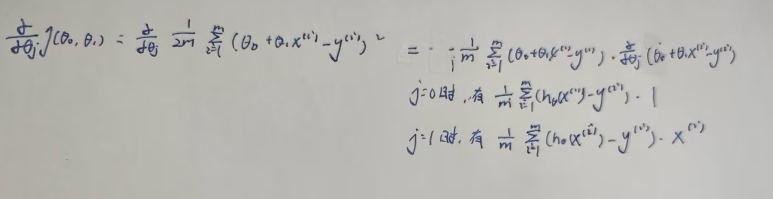
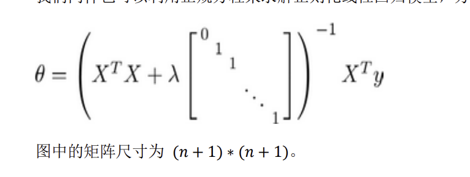

#  机器学习

# 代码注意事项

从n,m维的矩阵中取出的X[:,idx]**默认是行向量**


# 什么是机器学习

**一个程序被认为能从经验E中学习，解决任务T，达到性能度量值P，当且仅当有了经验E后，经过P的批判，程序能在处理T的时候性能有所提升。**其中E可以认为是成千上万次练习，而T可以认为是下棋，P则是赢得棋局的概率。


# 监督学习

监督学习是指**给算法一个数据集，并且给定正确的答案，算法的目标是给出更多的正确答案**。

监督学习有两类问题：其中一个是**回归问题**，**预测连续的输出值**；另一个是**分类问题**，**推测出离散的输出值**。


# 无监督学习

无监督学习就是给定一个无标签的数据集，从中找出某种数据结构。比如从音频中分离出人声和背景声。


# 模型表示


# 代价函数

拟合的目标是选择合适的参数使得代价平方误差函数最小。


对于回归问题，最基本的代价函数是均方误差损失函数


一阶拟合函数的代价函数变化如下


线性回归的代价函数是**convex function**


因此梯度下降一定可以得到**全局最优解**

# 梯度下降

梯度下降是一种用于求函数最小值的算法，其背后的思想是：**初始时选择一个任意的参数组合计算代价函数，然后寻找下一个能让代价函数下降最多的参数组合，一直重复操作直到到达一个局部最小值，初始时选择不同的参数可能会得到不同的全局最小值。**


批量梯度下降（batch gradient descent）算法的公式为：


展开有




注意要同时更新两个参数值，这里的a是**学习率**，代表每一次下降的大小。根据公式可以看出每一次更新参数值都会遍历一遍所有的数据，所以速度会很慢。


从一元函数来看，每次更新都会**减去斜率**，随着不断地更新，步幅也在不断的**减小**(代价函数趋向平稳)，当到达最小值时斜率为**0**则不会更新参数，此时收敛到局部最小值。


如果学习率太**小**会需要**很多步来逼近最小值**，如果学习率太**大**，可能会不**断越过最小点导致无法收敛**，经过证明的是，只要学习率足够小，代价会在每一轮迭代中下降，如果出现类似**弧形**的曲线，那么解决方案是**减小学习率**。

通常可以考虑尝试些学习率：  a =0.001，0.003，0.01，0.03，0.1，0.3，1，3，10


# 单变量线性回归


```python
path='ex1data1.txt'

# 读取数据
data=pd.read_csv(path,header=None,names=['Population','Profit'])

# 插入一行，作为偏移量
data.insert(0,'Ones',1)

cols=data.shape[1]

# 提取出输出和输出，转换为矩阵
X=np.matrix(data.iloc[:,:cols-1])
Y=np.matrix(data.iloc[:,-1:])

# 参数以一维形式初始化，计算时需要转置。第一个对应 偏移量的参数，第二个对于X的参数
theta=np.matrix(np.array([0,0]))

# 代价函数
def computCost(X,Y,theta):
    res=np.power((X*theta.T)-Y,2)
    return np.sum(res)/(2*len(X))


def batchGredientDescent(X,y,theta,iters,a):
    # 储存临时计算出的参乎上
    temp=np.matrix(np.zeros(theta.shape))
    # 储存每一轮迭代的代价
    cost=np.zeros(iters)
    # 参数个数
    parameter=int(theta.ravel().shape[1])
    
    # 迭代
    for i in range(iters):
        # 公式中的共有项
        error=(X*theta.T-y)
        
        # 同时更新
        for j in range(parameter):
            # 第一项是1不会有影响，因此正好更新了第二项
            term=np.multiply(error,X[:,j])
            # 公式求解
            temp[0,j]=theta[0,j]-(a/len(X))*np.sum(term)

        theta=temp
        cost[i]=computCost(X,Y,theta)
    return theta,cost


iters=1000
a=0.01

# 求解出最优参数
g,cost=batchGredientDescent(X,Y,theta,iters,a)

res=computCost(X,Y,g)

# 构图
fig,ax=plt.subplots(figsize=(12,8))
x=np.linspace(data['Population'].min(),data['Population'].max(),100)

ax.plot(x,g[0,0]+(g[0,1]*x),'r',label='Predit data')
ax.scatter(data['Population'],data['Profit'],label='Traning Data')
ax.set_xlabel('Population')
ax.set_ylabel('Profit')
ax.legend(loc=2)
ax.set_title('Predict data vs Population size')

plt.show()


fig,ax=plt.subplots(figsize=(12,8))
ax.plot(np.arange(iters),cost,'r')
ax.set_xlabel('Iteration')
ax.set_ylabel('Cost')
ax.set_title('Error vs traning Eproch')
plt.show()
```


通过观察代价函数在每一次迭代中的结果，可以检查算法是否正常工作


# 多变量线性回归

在单变量的基础上多了一些参数

```python
path='ex1data2.txt'
data=pd.read_csv(path,header=None,names=['area','cnt','price'])

data=(data-data.mean())/data.std()
data.insert(0,'Ones',1)

cols=data.shape[1]

x=data.iloc[:,0:-1]
y=data.iloc[:,-1:]

theta=np.matrix(np.array([0,0,0]))

X=np.matrix(x.values)
Y=np.matrix(y.values)

# 代价函数
def computCost(X,Y,theta):
    res=np.power((X*theta.T)-Y,2)
    return np.sum(res)/(2*len(X))
def batchGredientDescent(X,y,theta,iters,a):
    # 储存临时计算出的参乎上
    temp=np.matrix(np.zeros(theta.shape))
    # 储存每一轮迭代的代价
    cost=np.zeros(iters)
    # 参数个数
    parameter=int(theta.ravel().shape[1])
    
    # 迭代
    for i in range(iters):
        # 公式中的共有项
        error=(X*theta.T-y)
        
        # 同时更新
        for j in range(parameter):
            # 第一项是1不会有影响，因此正好更新了第二项
            term=np.multiply(error,X[:,j])
            # 公式求解
            temp[0,j]=theta[0,j]-(a/len(X))*np.sum(term)

        theta=temp
        cost[i]=computCost(X,Y,theta)
    return theta,cost

iters=1000
a=0.01

g,cost=batchGredientDescent(X,Y,theta,iters,a)


fig,ax=plt.subplots(figsize=(12,8))
ax.plot(np.arange(iters),cost,'r')
ax.set_xlabel('Iteration')
ax.set_ylabel('Cost')
plt.show()
```


# 库函数实现线性回归


```python
from sklearn import linear_model
from sklearn.datasets import fetch_california_housing
from sklearn.metrics import mean_squared_error, mean_absolute_error
# 导入数据集
hs_p= fetch_california_housing()

X=hs_p.data
y=hs_p.target

print(y)

# 转换为Dataframe类型方便插入
X=pd.DataFrame(X)

# 线性回归需要插入截距项
X.insert(0,-1,1)

# 导入模型
model=linear_model.LinearRegression()

# 训练数据，可以传入DataFrame和array类型，可以混搭
model.fit(X.iloc[:20000,:],y[:20000])

# 使用训练好的数据预测
res=model.predict(X.iloc[20000:,:])

# 比较误差，越小越好
print(mean_absolute_error(y[20000:],res))
print(mean_squared_error(y[20000:],res))
```


# 特征归一化

**归一化处理是将数据按比例缩放，使之落于一个较小的区间，在处理多个特征且量纲不同的数据时十分重要。**

**归一化可以提高模型收敛速度，提高模型精度，防止模型训练过程中发生数值计算错误，未经归一化处理的数据在搜索最优解的过程中可能会陷入缓慢前进或者模型震荡的状态，因为每个特征对模型的影响力不同，导致优化路径十分曲折。**


Z-score标准化，适用于有异常值的数据

```python
data=(data-data.mean())/data.std()
```


# 正规方程

在n较大的时候运行较慢(**1e3**的数量级，复杂度来自于矩阵的逆变换)，但是**不需要迭代**。

对于不可逆的矩阵，正规方程是不可用的


补充矩阵求导公式：


对于原公式


转换为矩阵形式有


展开求导，注意这里相乘的顺序不能颠倒


最后得到


直接套公式求解

```python
# 注意矩阵matrix已被弃用
X=np.array(x.values)
Y=np.array(y.values)

res=np.linalg.inv(X.T@X)@X.T@Y
```


# 逻辑回归

逻辑回归的假设模型是：**对于给定的输入变量，根据选择的参数计算输出变量等于1的可能**


其中g是sigmod函数，


当g(z)>=0.5时预测y=1，反之y=0，根据图像可知，z求出的结果>=0时y=1，反之y=0


因此当给定参数时，通过与0比较大小可以得到一条决策边界。


逻辑回归的代价函数定义为


从图像上理解：当目标值y是1，h(x)的结果表示输出量是1的可能，当可能越大代价函数就越小，当h(x)趋近于0时，代价函数也会越来越大(因为与正确结果相悖)


将式子合并有


使用梯度下降，代价函数有


最后有


注意下述的是实现中使用Truncated Newton Conjugate-Gradient（TNC）算法——截断牛顿共轭梯度(原理较为复杂)来寻找最优参数

fmin_tnc(func=cost,x0=theta,fprime=gradient,args=(x,y))，其中theta必须是行向量形式，且cost和fprime的第一个参数必须是theta

```python
filename='ex2data1.txt'
data=pd.read_csv(filename,header=None,names=['Exam1','Exam2','Admitted'])

# 按照类别划分数据
pos=data[data['Admitted']==1]
neg=data[data['Admitted']==0]

# 绘图
fig,ax=plt.subplots(figsize=(12,8))
ax.scatter(pos['Exam1'],pos['Exam2'],color='blue',label='AC')
ax.scatter(neg['Exam1'],neg['Exam2'],color='r',marker='x',label='WA')
ax.legend()

# plt.show()

# sigmod函数
def sigmod(x):
    return 1/(1+np.exp(-x))

# 常数项
data.insert(0,'Ones',1)
cols=data.shape[1]

# 正则化
data.iloc[:,1:-1]=(data.iloc[:,1:-1]-data.iloc[:,1:-1].mean())/data.iloc[:,1:-1].std()

# 输出和输出 X.shape, y.shape分别是((100, 3), (100, 1))
x=np.array(data.iloc[:,:cols-1].values)
y=np.array(data.iloc[:,cols-1:].values)

# 注意参数初始化为行向量，在计算时可以通过reshape(-1,1)变为列向量
theta=np.zeros(cols-1)

# 代价函数
def cost(theta,X,y):
    # 注意维度
    return -np.sum(y*np.log(sigmod(X@theta.reshape(-1,1)))+(1-y)*np.log(1-sigmod(X@theta.reshape(-1,1))))/len(X)

# 计算步长，没有执行梯度下降
def gradient(theta,X,y):
    paramater=theta.shape[0]
    term=np.zeros(paramater)
    error=(sigmod(X@theta.reshape(-1,1))-y)

    for j in range(paramater):
        # 下面是向量乘法
        term[j]=np.sum(error*X[:,j].reshape(-1,1))/len(X)
    return term

# fmin_tnc是一种常用的寻找最优参数的算法
# 按照参数的要求待机函数和梯度函数中第一个参数必须要(n,)的参数向量，其他的参数通过args用元组的形式传入
best_theta,_,_=opt.fmin_tnc(func=cost,x0=theta,fprime=gradient,args=(x,y))

# 给定参数和输入预测结果
def predict(X,theta):
    possible=sigmod(X@theta.reshape(-1,1))
    return [1 if x>=0.5 else 0 for x in possible]

# 比较预测值和真实值
res=predict(x,best_theta)
compare=[ 1 if i==j  else 0 for i,j in zip(res,y)]
accury=sum(compare)/len(compare)
print(accury)
```


注意逻辑回归一次只能处理二分类问题，因为我们根据h(x)的输出，来划分1和0，因此对于多个类别，需要为**每个类别训练一个模型**，求解某个类别时使用对应的模型来处理数据。


# 过拟合问题

通过引入**高阶项以及其他许多的特征**可以很好的拟合训练数据，但是训练出的模型**推广**到新的数据的效果并不好。


当出现了过拟合问题时，可以通过以下两种方法解决

+ 丢弃一些不必要的特征，或者使用模型来帮助选择特征
+ 正则化——保留所有的特征，但是减小参数的大小


# 正则化

正则化的基本思想是：在一定程度上**减小高次项参数的值**，所要做的是修改**代价函数**为其中的高次项参数引入**惩罚**，因此在尝试最小化代价函数的过程中也会将惩罚纳入考虑，最终选择较小的参数项。

如果有许多特征不知道要选取那些作为惩罚项时，将对**除了$\theta_0$的参数**引入惩罚


其中$\lambda$是正则化参数，如果过大会导致所有的参数都被最小化(为0)，图像变为一条直线。


对于线性回归的梯度下降有，对于参数$theta_0$特判


而对于正规方程需要额外添加一个**矩阵项**，经过证明的是$$X^TX+\theta[矩阵]$$一定是**可逆的**。





逻辑回归的式子与线性回归相同


代码实现见下

[regression_regularization](./个人代码实现/line_regression_regularization.html)

